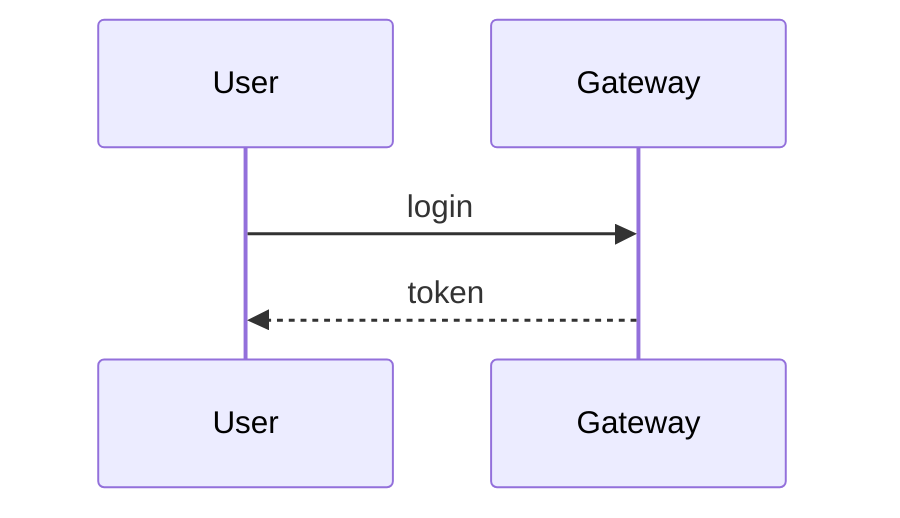
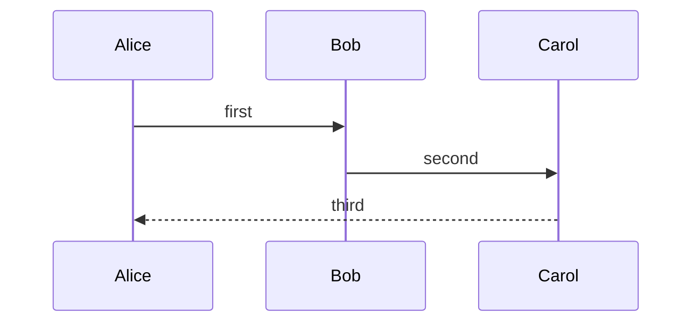
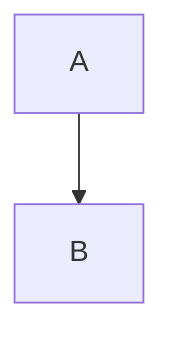

# Architecture

Sign-in flow:

```mermaid
sequenceDiagram
    participant U as User
    participant G as Gateway
    U->>G: login
    G-->>U: token
```

Some prose between diagrams.

```mermaid
sequenceDiagram
    Alice->>Bob: first
    Bob->>Carol: second
    Carol-->>Alice: third
```

```mermaid
flowchart TD
    A --> B
```
